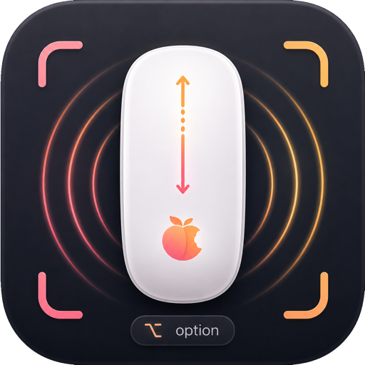

  
  
  # 🚀 Magic Mouse Zoom Bridge
  
  **Transform your Magic Mouse into a fluid, trackpad-style pinch-to-zoom powerhouse.**
  
  
  
  

   
  
  [English](README.md) • [🇹🇷 Türkçe](README_tr.md)

 

> 🤖 **Note:** This project was developed with AI.

**Magic Mouse Zoom Bridge** is a lightweight, low-level macOS background utility that instantly converts vertical scroll movements into true **native pinch-to-zoom magnification gestures**. 

If you use professional design software like **FreeCAD, KiCad, CAD tools, 3D viewers**, or simply want to fluidly zoom into high-res images in **Photos** and **Preview** without relying on clumsy keyboard shortcuts (like `Cmd` + `+`), this is the tool you've been waiting for!

---

## ✨ Features

- ⚙️ **100% Native Gesture Simulation:** We don't map keys. We translate standard `scroll-wheel` events directly into CoreGraphics `IOHIDEventPhase` sequences (Began, Changed, Ended).
- 🧈 **Buttery Smooth Continuous Zoom:** Enjoy true trackpad-like continuous zooming directly from your mouse surface!
- 🎛️ **Highly Customizable:** Easily adjust dead-zones, sensitivity, speed limits, and invert zoom directions in code!
- 🌍 **Universal Application Support:** Works seamlessly with Safari, Preview, Xcode, Figma, AutoCAD, and literally any native macOS app that supports trackpad pinch gestures.

---

## 📦 Installation & Build

You can quickly get started by downloading a pre-built binary, or building it yourself.

### Option 1: Download Release
1. Navigate to the [Releases](#) tab on GitHub.
2. Download `MagicMouseZoomBridge.app.zip`, extract it, and move it to your `/Applications` folder.

### Option 2: Build from Source
1. Clone this repository to your machine.
2. Open `MagicMouseZoomBridge.xcodeproj` in Xcode.
3. Build and Run (`Cmd + R`) or select **Product > Archive** to export your own build.

---

## 🎮 How to Use

The application runs quietly in the macOS menu bar. 

1. Press and hold the **Option (`⌥`)** key.
2. Gently scroll up or down on your Magic Mouse.
3. Watch the magic happen as the active application fluidly zooms in and out! 🚀
4. Release the Option key to instantly switch back to normal scrolling.

---

## 🔒 Permissions & Security

Because this utility intercepts global hardware input to generate synthetic system-level events, macOS requires you to grant explicit permissions. When you first launch the app, you will be prompted to grant:

- 👁️ **Accessibility:** Required to generate and inject low-level synthetic macOS trackpad gesture events.
- ⌨️ **Input Monitoring:** Required to install a low-level Event Tap that intercepts and consumes scroll wheel data before the OS sees it.

*These can be configured inside **System Settings > Privacy & Security**.*

---

## 🧠 Under the Hood

The app leverages a low-level CoreGraphics event tap (`CGEventTapCreate`). It listens for `kCGEventScrollWheel` and strips it from the event bus when `Option` is active. Simultaneously, it constructs synthetic `kCGEventGesture (Type 29)` payloads with the Apple Private SPIs for Zoom (`113`) and cleanly maps sequences to hardware HID Phases (`Began=1`, `Changed=2`, `Ended=4`).

> **⚠️ Note on Apple Private APIs:** This application utilizes undocumented CoreGraphics SPIs to generate raw system trackpad events. While entirely legal for open-source use, its behavior may change in future macOS major revisions.
